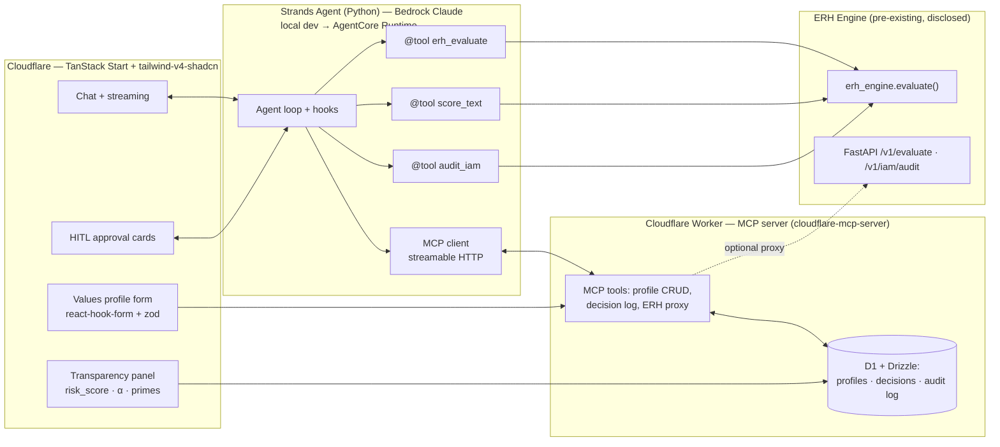

# ERH Guardian — Agents for Humans Hackathon Implementation Plan

> Target: [Agents for Humans hackathon](https://agentsforhumans.devpost.com/) · Deadline **Sep 14, 2026, 5:00pm PDT** · Written 2026-09-02 (~12 days remaining)

---

## 1. Suitability verdict — 用 Ethic-Latex 當基底合適嗎？

**Yes — with three corrections to the original assessment.**

Ethic-Latex is a strong base: `erh_engine` is a tested, containerized, domain-agnostic ethical-scoring service with a clean typed contract, and the "measurable ethical health" story (ERH bound, α ≈ 0.5) is a genuinely original fit for a hackathon judged on human value alignment, transparency, and creativity. But:

1. **The agent layer is 100% greenfield and must be Strands (Python).** There is zero AWS/Bedrock/Strands code in the repo today. The existing `claude-agent-sdk` / `openai-agents` skills are irrelevant to eligibility — judging explicitly weighs *depth of Strands Agents usage*. The good news: the work is a thin Strands layer over `erh_engine.evaluate()`, not a rewrite.
2. **Compliance requires a *new* project, not a rebrand.** Official rules: *"Projects must be newly created during the Submission Period"* (Aug 10 – Sep 14, 2026), and any incorporated pre-existing code must be **disclosed**. → Create a new repo (working name **`erh-guardian-agent`**, MIT license) built during the period, which imports/depends on the ERH engine as a disclosed pre-existing library. Do **not** submit Ethic-Latex itself.
3. **Cloudflare is fine for the MCP server + UI, but not for the agent.** Strands is a Python SDK — it cannot run on Cloudflare Workers. The Strands agent runs in Python (locally for the demo; Bedrock AgentCore Runtime or Lambda for deployment) and calls the Cloudflare-hosted MCP server over **streamable HTTP**, which Strands' native MCP client supports.

Note: the `.claude/skills` entries (`cloudflare-worker-base`, `cloudflare-mcp-server`, `drizzle-orm-d1`, `tanstack-start`, `tailwind-v4-shadcn`, `react-hook-form-zod`…) are **vendored skill templates only** — no actual Cloudflare/TanStack/D1 code exists in the repo yet. They accelerate development but nothing is pre-built.

**中文摘要**：可行。核心優勢是 `erh_engine` 已是可直接包裝成 agent 工具的純函式服務；但 (a) Strands/Bedrock 層需全新開發、(b) 依賽規必須以「新專案」形式提交並揭露沿用的 ERH 程式碼、(c) Strands agent 本體跑在 Python 環境（非 Cloudflare Workers），透過 streamable HTTP 呼叫 Cloudflare 上的 MCP server。

---

## 2. Verified hackathon requirements (Devpost, fetched 2026-09-02)

| Item | Requirement |
|---|---|
| SDK | **Strands Agents SDK — mandatory** |
| Deployment | Bedrock AgentCore optional but "a smart architectural choice" (rewarded) |
| Repo | Public GitHub, **MIT or Apache license**, README with setup instructions |
| Diagram | Architecture diagram required |
| Video | ≤ 5 minutes: working demo + pitch (problem / audience / why it matters) |
| Account | **AWS Builder ID** required; $50 AWS credits — request **by Sep 11, 12pm PT** |
| Pre-existing code | Project newly created during Aug 10–Sep 14; frameworks/templates/AI assistants OK; other pre-existing code must be disclosed |
| Bonus | Live demo link; blog on builder.aws.com with "Agents for Humans" in title (+0.6 pts) |
| Judging | Technical Implementation (Strands depth) · Design · Impact · Creativity · Presentation — equally weighted |
| Tracks | Everyday Agents / Professional Agents / Good Neighbor Agents · $40k total, $10k grand prize |
| Key dates | Submit by **Sep 14 5pm PDT** · Judging Sep 15–Oct 8 · Winners ~Oct 14 |

**Strands SDK facts** (strandsagents.com): Python 3.10+, `pip install strands-agents strands-agents-tools`; tools via `@tool` decorator (Pydantic-friendly); default model provider is **Bedrock** (`BedrockModel(model_id=..., region_name=...)`); native **MCP client** (stdio + streamable HTTP); streaming via `agent.stream_async()`; multi-agent patterns; hooks/observability.

---

## 3. Product concept & track

**ERH Guardian** — a values-aligned assistant whose every consequential action is scored by the ERH engine before execution:

- The Strands agent plans an action → calls the `erh_evaluate` tool → gets `risk_score` (0–100), `erh_satisfied`, `estimated_exponent` → if risk exceeds the user's configured threshold, it **stops and asks the human** (human-in-the-loop approval card in the UI).
- **Transparency panel**: every decision shows the ethical primes, error-growth exponent α, and the bound check — judges see *measurable* alignment, not vibes.
- Users define their **value-alignment profile** (boundaries, risk threshold, protected topics) in a validated settings form; the profile persists in D1 and conditions every evaluation.

**Recommended track: Professional Agents** — demo scenario: an IT/security assistant that audits AWS IAM permissions (`audit_iam` already walks real IAM via boto3 — perfect synergy with the required AWS account) and drafts remediation, with every recommendation ERH-scored and gated. Fallback framing for **Everyday Agents**: the same guardian gating everyday tasks (emails, purchases, advice).

---

## 4. Architecture

Key seams in the existing code:

- **Primary tool**: `erh_engine/engine.py:90` — `evaluate(request: EvaluateRequest) -> EvaluateResponse`. Pure, Pydantic-typed, no I/O. Wrap directly with `@tool`; the schema comes free from Pydantic.
- **Lightweight text scorer**: `erh_engine/adapters/scoring.py` — `ethical_value(text) -> float [-1,1]`, `text_complexity(text)`. Runs anywhere (lexical fallback when torch absent).
- **LLM guardrail**: `erh_engine/adapters/llm.py` — `evaluate_llm()`; add a `"bedrock"` branch in `_call_provider()` (line ~58, currently openai/anthropic only) using `boto3 bedrock-runtime converse`.
- **IAM audit**: `erh_engine/adapters/iam_cspm.py` — `audit_iam()` / `pull_aws_grants()` (boto3, currently undeclared dep — add `boto3` to the new project's deps).
- **Known bug to fix**: `erh_engine/adapters/llm.py:105` — `v = 1.0 if not ex.harmful_intent else 1.0`: both branches are `1.0`, so `harmful_intent` has no effect on scoring. Fix (e.g. `-1.0` for harmful) or deliberately redesign; either way document it.

---

## 5. Phase timeline (Sep 2 → Sep 14)

### Phase 0 — Compliance & accounts (Sep 2–3)
- [ ] Create AWS Builder ID; register on Devpost; **request $50 credits (hard deadline Sep 11)**.
- [ ] Enable Bedrock model access (Claude Sonnet) in the target region — approval can take time, do this first.
- [ ] Create new public repo `erh-guardian-agent`, MIT license, README stub with **disclosure section**: "Uses the pre-existing open-source ERH engine from dennislee928/Ethic-Latex as a scoring library."
- [ ] Decide dependency mode: `pip install erh` (PyPI package exists) or git dependency on Ethic-Latex.

### Phase 1 — Strands agent core (Sep 3–5)
- [ ] `pip install strands-agents strands-agents-tools boto3`; smoke-test `Agent(model=BedrockModel(...))("hello")`.
- [ ] Implement `@tool` wrappers: `erh_evaluate` (over `erh_engine.evaluate`), `score_text` (over `ethical_value`/`text_complexity`), `audit_iam`.
- [ ] Agent system prompt encoding the guardian behavior: score-before-act, threshold gate, explain verdicts in plain language.
- [ ] HITL gate: Strands hook (or tool-result branch) that pauses and emits an approval request when `risk_score > profile.threshold` or `erh_satisfied == false`.
- [ ] In Ethic-Latex: add `bedrock` branch to `_call_provider()`; fix the `harmful_intent` bug (small upstream PR — keeps engine improvements in the base repo, agent code in the new repo).
- [ ] CLI demo working end-to-end (this alone is a submittable fallback).

### Phase 2 — MCP server + persistence on Cloudflare (Sep 5–8)
- [ ] Scaffold Worker from `cloudflare-mcp-server` skill; streamable-HTTP MCP endpoint.
- [ ] D1 + Drizzle schema (`drizzle-orm-d1` skill): `profiles` (values, boundaries, risk threshold), `decisions` (action, scores, verdict, approved_by), `audit_log`.
- [ ] MCP tools: `get_profile` / `update_profile`, `log_decision`, `list_decisions`, optional `erh_evaluate` proxy to the FastAPI engine (deploy `erh_engine` container to Render/Railway using existing Dockerfile, or keep engine local in the agent process and use MCP only for state).
- [ ] Connect Strands `MCPClient` to the Worker URL; verify the agent reads its profile and logs decisions autonomously.
- [ ] Auth: keep it simple — bearer token; upgrade with `mcp-oauth-cloudflare` only if time allows.

### Phase 3 — Frontend (Sep 8–11)
- [ ] TanStack Start app (skill template) + `tailwind-v4-shadcn`; deploy on Cloudflare.
- [ ] Chat view streaming agent output (`agent.stream_async` behind a small FastAPI/WebSocket bridge, or poll the decision log for MVP).
- [ ] HITL approval cards (approve / deny / adjust threshold) writing back through MCP.
- [ ] Transparency panel: risk_score gauge, α exponent, ERH bound pass/fail, ethical primes list (data already in `EvaluateResponse.primes` / curves).
- [ ] Values-profile onboarding form with `react-hook-form` + `zod` matching the D1 schema.
- [ ] Dark mode (default in the shadcn template) — cheap Design-criterion points.

### Phase 4 — Deploy, docs, demo (Sep 11–14)
- [ ] Optional stretch: deploy agent to **Bedrock AgentCore Runtime** (judges reward it); otherwise show local agent + live Cloudflare UI.
- [ ] Architecture diagram (export the mermaid above), README with full setup, disclosure statement, license check.
- [ ] ≤5-min video: 30s problem ("agents need measurable ethics, not vibes") → 3 min live demo (IAM audit, threshold breach → HITL card, transparency panel) → 60s architecture + Strands depth → close with track/impact.
- [ ] Devpost text description; optional builder.aws.com blog "Agents for Humans: measuring agent ethics with the Ethical Riemann Hypothesis" (+0.6).
- [ ] **Submit ≥24h early (Sep 13).**

---

## 6. Risks & mitigations

| Risk | Mitigation |
|---|---|
| 12-day scope too large | Phase 1 CLI demo is a complete submittable fallback; Phases 2–3 are additive. Cut order if behind: AgentCore → OAuth → TanStack UI (fall back to Streamlit, already in repo) → keep Strands+ERH core at all costs. |
| Bedrock model access delay | Request access Day 1 (Phase 0); Strands supports Anthropic API as interim dev provider — but final demo must run on Bedrock for credibility. |
| "Newly created" rule challenge | New repo, first commit dated in period, explicit disclosure section, ERH engine consumed as a versioned dependency. |
| Live demo fragility | Record video against local stack; live Cloudflare link as bonus, not dependency. |
| `harmful_intent` bug undermines demo credibility | Fix in Phase 1 with a test; mention the fix in the blog (shows engineering depth). |
| Undeclared boto3 dep in `iam_cspm.py` | Declare boto3 explicitly in the new project. |

---

## 7. Submission checklist

- [ ] Public repo, MIT license, README + setup, pre-existing-code disclosure
- [ ] Architecture diagram
- [ ] ≤5-min video (working demo + pitch)
- [ ] Text description (features & functionality)
- [ ] AWS Builder ID linked; credits requested by Sep 11
- [ ] Track selected (Professional Agents)
- [ ] Optional: live demo URL, builder.aws.com blog post
- [ ] Submitted before Sep 14, 2026 5:00pm PDT
