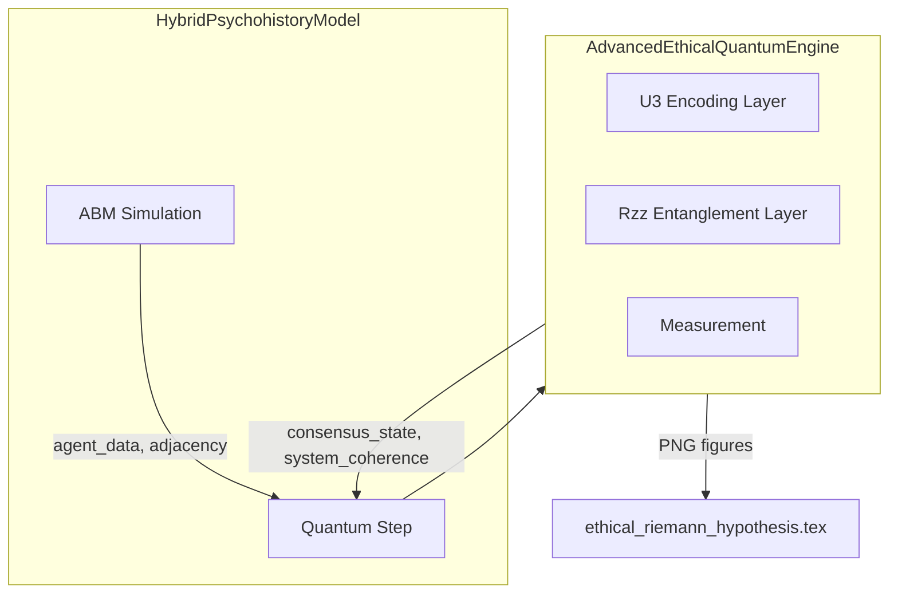

# Advanced Quantum Hilbert Space 實作計畫

## 科學增強摘要（Paper-Ready）

| 項目                           | 目的                  | 產出                            |
| ---------------------------- | ------------------- | ----------------------------- |
| **Quantum Error Mitigation** | 校正 IBM 硬體讀取錯誤       | 更可信的 measurement counts       |
| **Von Neumann Entropy**      | 量化「個體 vs 群體」社會糾纏度   | LaTeX 表格可用的 $H(\rho)$         |
| **Bloch Sphere 視覺化**         | 3D 呈現 agent 倫理姿態    | `bloch_state_step_*.png` 時間序列 |
| **State Caching**            | 避免重複 Hamiltonian 建構 | CI 加速約 2x–5x                  |

## 現況分析

- **現有 quantum 架構**：[simulation/quantum/simulator.py](simulation/quantum/simulator.py) 含 `SocialDynamicsQuantumSimulator`（VQE/Ising）、`AdvancedEthicalCircuit`（EfficientSU2）、`LocalQuantumJudge`（單一/雙量子位判斷）
- **Hybrid 模型**：[erh_core/core/hybrid_model.py](erh_core/core/hybrid_model.py) 的 `HybridPsychohistoryModel` 已用 `SocialDynamicsQuantumSimulator`（`enable_quantum=True` 時）
- **SocialNetwork**：[erh_core/core/social_network.py](erh_core/core/social_network.py) 無 `get_adjacency_submatrix`，hybrid 使用 `_get_interaction_matrix`（依 agent `error_rate` 相似度）
- **LaTeX**：[ethical_riemann_hypothesis.tex](ethical_riemann_hypothesis.tex) 第 334–348 行已有 Quantum 節，使用 `quantum_circuit_step_latest.png`
- **驗證**：`tests/test_update_plan_features.py` 與 `scripts/run_psychohistory_simulations.py` 會跑 hybrid + quantum

## 架構概覽

---

## Step 1: 量子核心升級 (simulation/quantum/simulator.py)

**目標**：在現有模組中新增 `AdvancedEthicalQuantumEngine`，保留既有類別以維持相容性。

- **新增類別 `AdvancedEthicalQuantumEngine**`：
  - `__init__(num_agents, use_real_hardware=False)`：初始化 `AerSimulator`，可選 IBM 後端
  - `build_social_circuit(agent_states, adjacency_matrix)`：使用 U3 編碼 Bloch 球面，Rzz 編碼社會糾纏
  - `run_simulation(agent_data, adjacency_matrix, shot_count=1024)`：執行並回傳 collapsed ethical reality
  - `_analyze_results(counts, qc)`：計算 consensus、system_coherence，並儲存電路圖與直方圖
- **技術注意事項**：
  - Qiskit 的 `qc.u(theta, phi, lam, qubit)` 第三參數為 `lam`（非 `lambda`），使用 `state['lambda']` 時需對應
  - `qc.draw(output='mpl')` 回傳 `Figure`，需用 `fig.savefig(path)` 儲存
  - `plot_histogram(counts)` 回傳 Figure，同樣以 `savefig` 存檔
  - 使用 `qiskit.circuit.library.UGate` 或 `QuantumCircuit.u`，並加上 `_QISKIT_AVAILABLE` 檢查
- **輸出路徑**：
  - `simulation/output/figures/latest_quantum_circuit.png`
  - `simulation/output/figures/latest_quantum_distribution.png`
- **無 Qiskit 時**：提供 NumPy fallback，或回傳 mock 結果並在 docstring 標註

### 1a. Quantum Error Mitigation (Readout Error Mitigation)

**目標**：在真實 IBM Quantum 硬體上校正讀取錯誤（0 測成 1），使結果具科學實用性。

- 於 `AdvancedEthicalQuantumEngine` 新增 `apply_error_mitigation(raw_counts, qubit_list)`：
  - 使用 `complete_meas_cal` 產生校準電路（所有基底態）
  - 在 simulator/hardware 上跑校準電路
  - 以 `CompleteMeasFitter` 建立 correction filter，並套用到 raw counts
- **注意**：Qiskit 1.x/2.x 可能調整 `qiskit.utils.mitigation` API，實作時需依現有版本檢查；若 API 已變更，可改為 try/except 或條件導入，並在無 mitigation 時回傳 raw counts
- 建議在主 simulation loop 前執行一次校準，可選參數 `use_error_mitigation: bool = False`（預設關閉，因 Aer 模擬器無雜訊）

---

## Step 2: SocialNetwork 擴充 (erh_core/core/social_network.py)

**目標**：提供 `get_adjacency_submatrix(n)` 供 quantum engine 使用。

- 新增 `get_adjacency_submatrix(self, n: int) -> np.ndarray`：
  - 對前 `n` 個節點（0..n-1）建立 n×n 鄰接矩陣
  - 邊權使用 `graph[i][j].get('weight', 1.0)`，無邊則為 0
  - 若 `n > num_nodes`，回傳適當尺寸並以 0 填充

---

## Step 3: Hybrid Model 整合 (erh_core/core/hybrid_model.py)

**目標**：在 quantum 區塊改用 `AdvancedEthicalQuantumEngine`，並維持既有 `results['quantum_stability']` 介面。

- **屬性映射**（Agent 無 `empathy/flexibility/resilience` 時）：
  - `empathy` ← `getattr(a, 'empathy', 1.0 - a.error_rate)`
  - `flexibility` ← `getattr(a, 'flexibility', 0.5 + a.judgment_tendency / 2)`
  - `resilience` ← `getattr(a, 'resilience', 1.0 - a.error_rate)`
- **鄰接矩陣取得**：
  - 若 `self.abm_simulator.network` 有 `get_adjacency_submatrix`，則使用
  - 否則 fallback 至現有 `_get_interaction_matrix(agents)`
- **整合邏輯**（在 `enable_quantum` 區塊內）：
  - 使用 `AdvancedEthicalQuantumEngine` 取代 `SocialDynamicsQuantumSimulator`
  - 維持 `quantum_agents_subsample`（建議 cap 20 qubits）
  - 將 `q_results` 寫入 `results['quantum_stability']`（含 `consensus_state`, `system_coherence`, `circuit_image`, `dist_image`）
- **apply_global_boost**：若需回饋到 classical agents，可新增 stub 或暫時略過，在計畫中註記為後續擴充

### 3a. State Caching (Hamiltonian Memoization)

**目標**：社會網絡拓樸在連續多步內往往不變，避免重複計算 Hamiltonian，加速 CI pipeline 約 2x–5x。

- 於 `HybridPsychohistoryModel` 新增：
  - `_hamiltonian_cache: Dict[str, Any] = {}`
  - `_get_cache_key(adj_matrix, biases) -> str`：以 `hashlib.md5(adj_matrix.tobytes() + np.array(biases).tobytes()).hexdigest()` 產生不可變 hash
- 在 quantum step 中：若 cache key 存在則重用已計算的 Hamiltonian，否則計算並寫入 cache
- 適用於 `SocialDynamicsQuantumSimulator.construct_hamiltonian` 或 `AdvancedEthicalQuantumEngine` 等昂貴建構步驟

---

## Step 4: LaTeX 報告更新 (ethical_riemann_hypothesis.tex)

**目標**：更新 Quantum 節，並納入電路圖與機率分佈圖。

- **第 334–356 行區塊**：
  - 將標題改為「Quantum Simulation of High-Dimensional Ethical States」
  - 加入 Hilbert space 與 Bloch 球面描述：$|\psi_i\rangle = \cos\frac{\theta_i}{2}|0\rangle + e^{i\phi_i}\sin\frac{\theta_i}{2}|1\rangle$
  - 說明 $R_{ZZ}(\gamma_{ij})$ 與互動強度 $\gamma_{ij}$ 的對應
- **圖表**：
  - 電路圖：`simulation/output/figures/latest_quantum_circuit.png`
  - 分佈圖：`simulation/output/figures/latest_quantum_distribution.png`
  - 使用 `\IfFileExists` 包裝，若檔不存在則顯示佔位提示

---

## Step 4a: 科學分析與視覺化增強

### Von Neumann Entropy（社會糾纏度）

**目標**：量化社會為「個體集合」或「群體意識」——低熵表示獨立，高熵表示深度糾纏。

- 於 [erh_core/analysis/statistics.py](erh_core/analysis/statistics.py) 新增 `calculate_von_neumann_entropy(density_matrix: np.ndarray) -> float`：
  - $H(\rho) = -\mathrm{Tr}(\rho \ln \rho)$
  - 以 `np.linalg.eigvalsh` 取本徵值，`np.clip(eigenvals, 1e-15, 1.0)` 避免 log(0)
  - 回傳 `-np.sum(eigenvals * np.log(eigenvals))`
- 於 [simulation/analysis/statistics.py](simulation/analysis/statistics.py) 的 `__all__` 中 export `calculate_von_neumann_entropy`
- 將 `von_neumann_entropy` 納入 `q_results` 或 `results['quantum_stability']`，供 LaTeX 表格使用

### Bloch Sphere 視覺化

**目標**：以 Bloch 球面 3D 圖呈現 agent 的倫理姿態，提升論文視覺衝擊。

- 於 [simulation/visualization/plots.py](simulation/visualization/plots.py) 新增 `save_bloch_sphere_snapshot(state_vector, step_number, save_dir) -> str`：
  - 使用 `qiskit.visualization.plot_bloch_multivector(state_vector)` 繪製多 qubit Bloch 表示
  - 儲存為 `{save_dir}/bloch_state_step_{step_number:03d}.png`，dpi=300
  - 回傳檔案路徑
- 在 hybrid model 的 quantum step 中，每 N 步（如 10）呼叫一次，產生「倫理旋轉」時間序列圖
- 需處理 `plot_bloch_multivector` 對多 qubit 的支援（可能需分開繪製或使用適當 API）

---

## Step 5: 依賴與 CI 調整

**requirements.txt**：

- 啟用或新增 `qiskit>=1.0.0`、`qiskit-aer>=0.14.0`（與 quantum_tests.yml 一致）

**simulation.yml**：

- 在 `simulate` job 後（或 report job 中）加入「Upload Simulation Figures」：
  - 上傳 `simulation/output/figures/*.png` 作為 `quantum-figures` artifact
  - 條件：僅在產生 quantum 圖時上傳，可用 `if-no-files-found: ignore`
- **注意**：`run_simulation_batch.py` 不跑 hybrid model，建議在 report job 或新增 job 中執行 `run_psychohistory_simulations.py` 以觸發 quantum 圖產生；或接受圖檔可能為空並用 `continue-on-error` / `if-no-files-found`

---

## Step 6: Cursor Plan 檔案

**路徑**：[.cursor/plans/advanced_quantum_integration.plan.md](.cursor/plans/advanced_quantum_integration.plan.md)

- 內容基於使用者提供的 `cursor.plan.md` 結構
- 納入本計畫的具體檔案路徑與檢查清單

---

## Step 7: 驗證

1. **單元測試**：確認 `AdvancedEthicalQuantumEngine` 可獨立執行（含/不含 Qiskit）
2. **整合測試**：`pytest tests/test_update_plan_features.py -k quantum -v`
3. **端到端**：執行 `run_psychohistory_simulations.py`（含 `enable_quantum=True`）
4. **圖檔**：檢查 `simulation/output/figures/` 是否產生 `latest_quantum_circuit.png`、`latest_quantum_distribution.png`、`bloch_state_step_*.png`
5. **LaTeX**：編譯 `ethical_riemann_hypothesis.tex`，確認圖表顯示正確
6. **科學指標**：驗證 `calculate_von_neumann_entropy` 回傳合理數值，並出現於 `results['quantum_stability']`
7. **快取**：確認連續相同拓樸時出現 cache hit，CI 執行時間縮短

---

## 檔案變更總覽

| 檔案                                                                     | 變更                                                                            |
| ---------------------------------------------------------------------- | ----------------------------------------------------------------------------- |
| [simulation/quantum/simulator.py](simulation/quantum/simulator.py)     | 新增 `AdvancedEthicalQuantumEngine`、`apply_error_mitigation`                    |
| [erh_core/core/social_network.py](erh_core/core/social_network.py)     | 新增 `get_adjacency_submatrix`                                                  |
| [erh_core/core/hybrid_model.py](erh_core/core/hybrid_model.py)         | 切換至 `AdvancedEthicalQuantumEngine`、新增 `_hamiltonian_cache` 與 `_get_cache_key` |
| [erh_core/analysis/statistics.py](erh_core/analysis/statistics.py)     | 新增 `calculate_von_neumann_entropy`                                            |
| [simulation/analysis/statistics.py](simulation/analysis/statistics.py) | export `calculate_von_neumann_entropy`                                        |
| [simulation/visualization/plots.py](simulation/visualization/plots.py) | 新增 `save_bloch_sphere_snapshot`                                               |
| [ethical_riemann_hypothesis.tex](ethical_riemann_hypothesis.tex)       | 更新 Quantum 節與圖表路徑                                                             |
| [requirements.txt](requirements.txt)                                   | 啟用 qiskit / qiskit-aer                                                        |
| [.github/workflows/simulation.yml](.github/workflows/simulation.yml)   | 新增 Upload quantum-figures artifact                                            |

