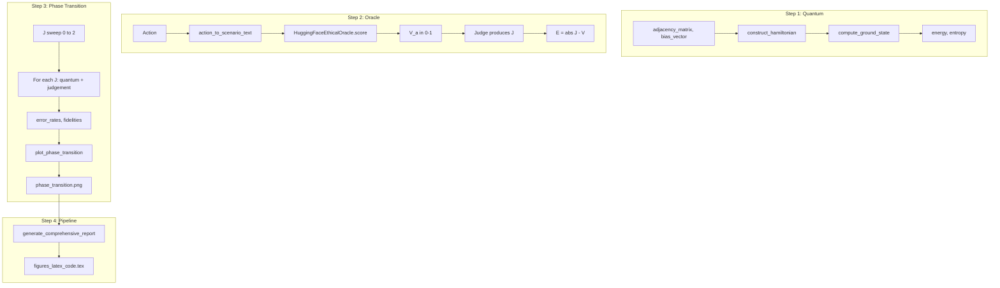

# ERH Phase 2 Scientific Upgrade 實作計畫

## 審查報告對應表


| 維度       | 現況                      | 目標            | Phase 2 對應步驟                                            |
| -------- | ----------------------- | ------------- | ------------------------------------------------------- |
| **實證模擬** | ⭐⭐ 骨架有，量子核心仍是玩具模型、靈魂未到位 | 微幅提升 → ⭐⭐⭐    | Step 1: `compute_ground_state()` 精確解；Step 3: 參數化 J 掃描實驗 |
| **實用性**  | ⭐⭐ 依賴隨機「上帝視角」數據         | 持平→提升 → ⭐⭐⭐   | Step 2: `HuggingFaceEthicalOracle` 取代 `np.random`       |
| **自動化**  | ⭐⭐⭐ 流程有，腳本似有缺失          | 新增亮點：AI 科學家雛形 | Step 4: 補齊 phase transition 呼叫；CI 整合缺失腳本                |


---

## 現況分析

**已有資產：**

- [simulation/quantum/simulator.py](simulation/quantum/simulator.py)：`SocialDynamicsQuantumSimulator` 已具 `construct_hamiltonian()` (ZZ + X 項)、VQE；`MoralHamiltonian` 有 `run_phase_transition_sweep()`
- [scripts/run_quantum_phase_transition.py](scripts/run_quantum_phase_transition.py)：以 conflict density 掃描，產出 `phase_transition_diagram.png`
- [simulation/visualization/plots.py](simulation/visualization/plots.py)：已有 `plot_phase_transition_diagram()` (conflict density vs fidelity)
- [simulation/core/judgement_system.py](simulation/core/judgement_system.py)：有 `GroundTruthProxy`；`erh_core/core/judgement_system.py` 使用 `action.V` 直接
- [erh/core/scenario_generator.py](erh/core/scenario_generator.py)：`action_to_scenario_text()` 可將 Action 轉為文字供模型評分

**需補強：**

- 量子：新增 `compute_ground_state()` 回傳 energy + entropy；以 coupling strength J 為控制參數掃描
- 真實數據：用 HuggingFace 取代 `np.random` 產生 V(a)
- 圖表：整合 Error Rate 與 Quantum Fidelity 的 Phase Transition 圖
- 流程：`generate_comprehensive_report.py` 需呼叫 phase transition 並產生 LaTeX 片段

---

## Step 1: Quantum Core 「物理化」(Ising Model)

**目標：** 強化 `simulation/quantum/simulator.py`，支援多體互動與精確基態計算。

### 1.1 擴充 `SocialDynamicsQuantumSimulator`（選項 B）

在既有 `SocialDynamicsQuantumSimulator` 上加 `compute_ground_state()`，避免重複。

### 1.2 新增 `compute_ground_state()` 方法

```python
def compute_ground_state(
    self,
    adjacency_matrix: np.ndarray,
    bias_vector: np.ndarray,
) -> Tuple[float, float]:
    """Return (energy, entropy) using NumPyMinimumEigensolver (exact)."""
```

- 使用 `NumPyMinimumEigensolver`（或 `qiskit.algorithms.minimum_eigensolvers`）解精確基態
- 能量：對應社會張力
- 熵：`von_neumann_entropy_from_statevector()` 對半鏈 partial trace

### 1.3 實證模擬強化要點


| 解決方案   | 實作要點                                                             |
| ------ | ---------------------------------------------------------------- |
| 精確基態解  | 取代 VQE 近似，回傳 (energy, entropy)                                   |
| 物理參數掃描 | J 為唯一控制參數（0→2），每點產生可重現的 adjacency + bias                         |
| 單位測試驗證 | 新增 `test_simulator.py`：檢查 Hamiltonian 含 $Z_i Z_j$ 與 $X_i$ 項      |
| 實驗元數據  | 將 `seed`、`n_qubits`、`J_range` 寫入 `phase_transition_results.json` |


### 1.4 保留/調整的介面

- `construct_hamiltonian(adjacency_matrix, bias_vector)` 已存在（參數名為 `interaction_matrix`, `biases`）
- 不移除 `LocalQuantumJudge` 等舊 API，僅不再依賴於 phase transition 流程

---

## Step 2: 真實數據代理 (HuggingFace Oracle)

**目標：** 替換 `generate_world` 中的 `np.random` 產生 V(a)，改為 HuggingFace 模型評分。

### 2.1 建立 `erh_core/core/oracle.py`

```python
class HuggingFaceEthicalOracle:
    """使用 pre-trained 模型（如 unitary/toxic-bert）對 action 文字評分為 0.0–1.0。"""
    def __init__(self, model_name: str = "unitary/toxic-bert", cache_path: str | None = None)
    def score(self, action_text: str) -> float  # 0.0–1.0，需映射到 [-1,1] 若沿用現有 Action
```

- 模型選擇：`unitary/toxic-bert` (toxicity) → `V = 2 * (1 - toxicity) - 1` 映射到 [-1,1]；或 `cardiffnlp/twitter-roberta-base-sentiment`
- 快取：以 action_text 的 hash 為 key，存 JSON cache，避免重複 inference

### 2.2 實用性強化要點


| 解決方案               | 實作要點                                                                             |
| ------------------ | -------------------------------------------------------------------------------- |
| HuggingFace Oracle | 對 action 文字評分，映射到 [-1,1]                                                         |
| 可選 fallback        | 若 `transformers` 未安裝，回退到 `np.random`，log 警告                                      |
| 真實數據橋接             | 支援 `GroundTruthProxy.load_from_csv()` 與 Oracle 並存：優先 CSV，缺則用 Oracle              |
| Action 文字生成        | 在 `generate_world` 後呼叫 `action_to_scenario_text(action)` 寫入 `action.description` |


### 2.3 整合至 `erh_core/core/judgement_system.py`

- 在 `evaluate_judgement` 前，若使用 `HuggingFaceEthicalOracle`，則以 `oracle.score(action_text)` 覆寫 `action.V`
- 或新增 `OracleDrivenJudge`：接受 `HuggingFaceEthicalOracle`，在 `judge()` 前先設定 `action.V`
- 定義 $E(x) = |Agent_Prediction - Oracle_Score|$

### 2.4 相依性

- 在 `requirements.txt` 加入：`transformers>=4.30.0`, `torch`

---

## Step 3: Phase Transition 關鍵圖表

**目標：** 繪製 coupling strength vs 倫理穩定性、標記臨界點。

### 3.1 建立 `scripts/run_phase_transition_exp.py`

- 控制參數：`coupling_strength` $J$ 從 0.0 到 2.0，步長可設約 0.1–0.2
- 對每個 $J$：
  1. 建立 adjacency matrix（例如 uniform $J$ 或隨機結構）
  2. 執行量子模擬：`compute_ground_state()` 或 `MoralHamiltonian.run_phase_transition_sweep()` 取得 fidelity
  3. 執行倫理模擬：`generate_world` → 透過 `HuggingFaceEthicalOracle` 設定 V → 用 Judge 得到 J → 計算 Error Rate
- 輸出：`coupling_strengths`, `error_rates`, `fidelities`, `critical_point_J`

### 3.2 擴充 `simulation/visualization/plots.py`

- 新增 `plot_phase_transition(data)`：
  - X 軸：Coupling Strength ($J$) / Complexity
  - Y 軸：Ethical Stability = 1 - Error Rate
  - 標記 Critical Point $J_c$（scipy 擬合或啟發式：第一次 Error Rate > 閾值）
  - 風格：`seaborn.set_style("paper")` 以便 LaTeX 相容

### 3.3 輸出路徑

- 圖檔：`simulation/output/figures/phase_transition.png`
- JSON：`simulation/output/phase_transition_results.json`（含 `seed`、`J_range` 等元數據）

---

## Step 4: 流程與 LaTeX 整合

### 4.1 更新 `scripts/generate_comprehensive_report.py`

- 開頭呼叫 `run_phase_transition_exp.py`（subprocess 或 import 其 main），確保 phase_transition.png 存在
- 空結果容錯：`combined_results` 為空時仍可產出 phase transition 圖，不因 `ls -A` 失敗而中斷
- 產生 LaTeX 片段，寫入 `simulation/output/figures_latex_code.tex`

### 4.2 自動化強化要點


| 解決方案                       | 實作要點                                                                           |
| -------------------------- | ------------------------------------------------------------------------------ |
| Report 前跑 Phase Transition | `generate_comprehensive_report.py` 開頭呼叫                                        |
| 空結果容錯                      | combined_results 為空時仍產出 phase transition 圖                                     |
| CI 新增 Phase Transition job | 在 `simulation.yml` 的 `report` job 前新增 `phase-transition` job                   |
| 單一入口腳本                     | 新增 `scripts/run_full_pipeline.sh`：batch → phase transition → report → LaTeX 片段 |


### 4.3 LaTeX 整合

- [ethical_riemann_hypothesis.tex](ethical_riemann_hypothesis.tex) 第 396–405 行已 include `phase_transition_diagram.png`
- 統一路徑：`simulation/output/figures/phase_transition.png` 或更新 `\IfFileExists` 檢查

---

## 架構與資料流




---

## 驗證清單


| 項目  | 驗證方式                                                                                               |
| --- | -------------------------------------------------------------------------------------------------- |
| 量子  | `simulator.py` 產生含 $Z_i Z_j$ 與 $X_i$ 的 Hamiltonian                                                 |
| 數據  | `oracle.py` 有 `import transformers` 且 `judgement_system` 可注入 Oracle                                |
| 視覺  | `simulation/output/figures/phase_transition.png` 存在                                                |
| 自動化 | `python scripts/generate_comprehensive_report.py --input-dir results` 會更新 phase transition 與 LaTeX |
| 實證  | `phase_transition_results.json` 含 `seed`、`J_range` 等元數據                                            |
| 腳本  | `run_full_pipeline.sh` 或等效流程可一鍵產出論文圖表                                                              |


---

## 風險與注意事項

1. **HuggingFace 依賴**：`transformers` 與 `torch` 體積大，可考慮 `transformers[torch]` 或提供 lightweight 選項
2. **Action 無文字**：`generate_world` 預設無 `description`，需用 `action_to_scenario_text` 或改 `generate_world` 產生描述
3. **路徑不一致**：現有 LaTeX 指向 `simulation/output/phase_transition_diagram.png`，plan 期望 `figures/phase_transition.png`，需統一路徑
4. **Qiskit 版本**：`NumPyMinimumEigensolver` 在 `qiskit_algorithms` 與 `qiskit.algorithms` 之間可能不同，需保留 try/except 以相容多版本

---

## 與既有 cursor.plan.md 的關係

- **Part C（量子）**：Phase 2 Step 1 對應 C1.1、C1.2，並新增 `compute_ground_state()`
- **Part D（腳本）**：Phase 2 Step 4 對應 D3、D4，並補齊 `generate_comprehensive_report` 與 CI
- **A1.1（V(a) 近似）**：Phase 2 Step 2 的 HuggingFace Oracle 即「近似真實道德值」的實作之一

