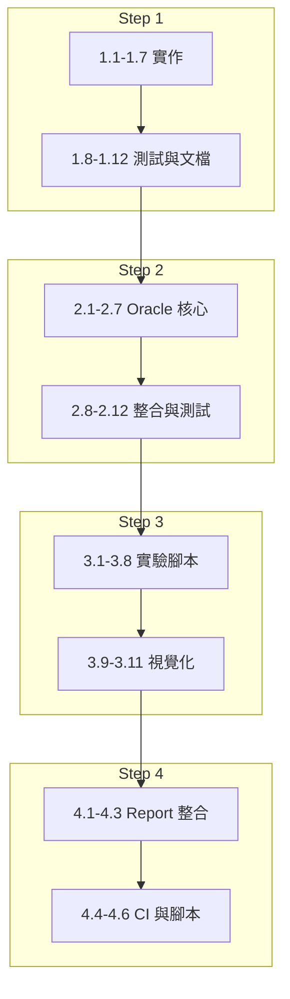

# ERH Phase 2 Todos 擴充計畫

將 [erh_phase2_scientific_upgrade.plan.md](.cursor/plans/erh_phase2_scientific_upgrade.plan.md) 的 todo 從 4 個擴充為 35 個精細項目。

---

## Todo 清單（35 項）

### Step 1: Quantum Core（12 項）


| ID   | 項目                                                                                                                      |
| ---- | ----------------------------------------------------------------------------------------------------------------------- |
| 1.1  | 在 `simulator.py` 新增 `NumPyMinimumEigensolver` import，處理 `qiskit_algorithms` 與 `qiskit.algorithms` 雙版本 fallback          |
| 1.2  | 在 `SocialDynamicsQuantumSimulator` 新增 `compute_ground_state(adjacency_matrix, bias_vector) -> Tuple[float, float]` 方法簽章 |
| 1.3  | 在 `compute_ground_state` 內呼叫既有 `construct_hamiltonian(interaction_matrix, biases)`                                      |
| 1.4  | 實作 eigenvalue solver 呼叫：`NumPyMinimumEigensolver().compute_minimum_eigenvalue(hamiltonian)`                             |
| 1.5  | 從 solver result 取得 eigenstate，轉為 `Statevector` 或 `np.ndarray`                                                           |
| 1.6  | 呼叫 `von_neumann_entropy_from_statevector()` 對半鏈做 partial trace，取得 entropy                                               |
| 1.7  | 當 `_VQE_AVAILABLE` 為 False 時回傳 `(0.0, 0.0)` 或 mock 值，並 log 警告                                                           |
| 1.8  | 新增 `tests/test_simulator_ising.py`：assert `construct_hamiltonian` 產生的 Pauli 串含至少一組 `ZZ`                                 |
| 1.9  | 同上：assert `construct_hamiltonian` 產生的 Pauli 串含至少一組 `X`                                                                  |
| 1.10 | 同上：assert `compute_ground_state` 回傳型別為 `Tuple[float, float]`                                                            |
| 1.11 | 同上：assert `compute_ground_state` 的 energy 為實數（當 Hamiltonian 為實對稱）                                                       |
| 1.12 | 在 `compute_ground_state` 加上完整 docstring（Parameters, Returns, Examples）                                                  |


### Step 2: HuggingFace Oracle（11 項）


| ID   | 項目                                                                                                                            |
| ---- | ----------------------------------------------------------------------------------------------------------------------------- |
| 2.1  | 建立 `erh_core/core/oracle.py`，定義 `HuggingFaceEthicalOracle` 類別                                                                 |
| 2.2  | 實作 `__init__(model_name, cache_path)`，支援預設 `unitary/toxic-bert`                                                               |
| 2.3  | 實作 lazy model loading：首次 `score()` 時才 `AutoModelForSequenceClassification.from_pretrained`                                    |
| 2.4  | 實作 `score(action_text: str) -> float`，回傳 0.0–1.0（toxicity 或 1-sentiment）                                                      |
| 2.5  | 實作 `_to_V(score: float) -> float`：`V = 2 * (1 - toxicity) - 1` 映射到 [-1, 1]                                                    |
| 2.6  | 實作 JSON cache：`hashlib.sha256(action_text.encode()).hexdigest()` 為 key，存 `{hash: score}`                                      |
| 2.7  | 若 `transformers` 未安裝，`score()` 回傳 0.0 並 `logging.warning`，不 raise                                                             |
| 2.8  | 在 `erh_core/core/action_space.py` 的 `Action` 確認有 `description: Optional[str]` 欄位                                              |
| 2.9  | 新增 `populate_action_descriptions(actions, template="minimal")`：呼叫 `action_to_scenario_text` 寫入 `action.description`           |
| 2.10 | 新增 `OracleDrivenJudge(BaseJudge)`：接受 `HuggingFaceEthicalOracle`，`judge()` 前以 `oracle.score(action.description)` 覆寫 `action.V` |
| 2.11 | 在 `requirements.txt` 加入 `transformers>=4.30.0`、`torch`（或 `transformers[torch]`）                                               |
| 2.12 | 新增 `tests/test_oracle.py`：mock 模型，assert `score()` 回傳值在 [-1, 1]                                                               |


### Step 3: Phase Transition（8 項）


| ID   | 項目                                                                                                                                             |
| ---- | ---------------------------------------------------------------------------------------------------------------------------------------------- |
| 3.1  | 建立 `scripts/run_phase_transition_exp.py`，定義 `main()` 入口                                                                                        |
| 3.2  | 新增 argparse：`--J-min=0`, `--J-max=2`, `--n-points=21`, `--seed=42`, `--n-qubits=4`, `--output-dir`                                             |
| 3.3  | 實作 J sweep：`J_values = np.linspace(J_min, J_max, n_points)`                                                                                    |
| 3.4  | 對每個 J：建立 adjacency matrix（uniform J 或 `J * np.random.rand(n,n)` 對稱化），用 seed 確保可重現                                                              |
| 3.5  | 對每個 J：呼叫 `SocialDynamicsQuantumSimulator.compute_ground_state` 或 `MoralHamiltonian.run_phase_transition_sweep`，取得 energy/fidelity              |
| 3.6  | 對每個 J：執行 `generate_world` → `populate_action_descriptions` → `OracleDrivenJudge` → `evaluate_judgement` → 計算 `error_rate = mean(mistake_flag)` |
| 3.7  | 計算 `critical_point_J`：第一個 `error_rate > 0.5` 的 J，或 scipy `curve_fit` 擬合拐點                                                                      |
| 3.8  | 寫入 `phase_transition_results.json`，含 `coupling_strengths`, `error_rates`, `fidelities`, `critical_point_J`, `seed`, `n_qubits`, `J_range`      |
| 3.9  | 在 `simulation/visualization/plots.py` 新增 `plot_phase_transition(data: dict)`                                                                   |
| 3.10 | `plot_phase_transition`：X 軸 J、Y 軸 `1 - error_rate`，標記 `critical_point_J` 垂直線                                                                   |
| 3.11 | `plot_phase_transition`：使用 `seaborn.set_style("paper")`，save 至 `simulation/output/figures/phase_transition.png`                                |


### Step 4: Pipeline 與 LaTeX（4 項）


| ID  | 項目                                                                                                                                                     |
| --- | ------------------------------------------------------------------------------------------------------------------------------------------------------ |
| 4.1 | 在 `generate_comprehensive_report.py` 開頭呼叫 `run_phase_transition_exp.main()` 或 `subprocess.run(["python", "scripts/run_phase_transition_exp.py", ...])` |
| 4.2 | 修改 `generate_comprehensive_report.py`：當 `combined_results` 為空時跳過 `load_results`，但仍執行 phase transition 與圖表產出                                            |
| 4.3 | 在 `figures_latex_code.tex` 或 report 產出邏輯中加入 `phase_transition.png` 的 `\includegraphics` 片段                                                             |
| 4.4 | 在 `.github/workflows/simulation.yml` 的 `report` job 前新增 `phase-transition` job，產出 `phase_transition.png` artifact                                      |
| 4.5 | 建立 `scripts/run_full_pipeline.sh`：依序執行 `run_simulation_batch.py`、`run_phase_transition_exp.py`、`generate_comprehensive_report.py`                      |
| 4.6 | 更新 `ethical_riemann_hypothesis.tex` 的 `\IfFileExists` 路徑為 `simulation/output/figures/phase_transition.png`（若與現有不同）                                     |


---

## 執行順序建議




---

## 更新計畫檔方式

將上述 35 項 todo 寫入 [erh_phase2_scientific_upgrade.plan.md](.cursor/plans/erh_phase2_scientific_upgrade.plan.md) 的 frontmatter `todos` 區塊，每項格式為：

```yaml
- id: 1.1
  content: 在 simulator.py 新增 NumPyMinimumEigensolver import ...
  status: pending
```

