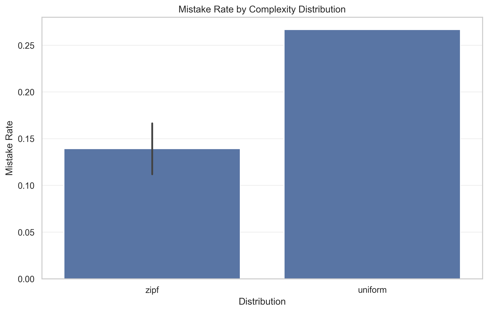
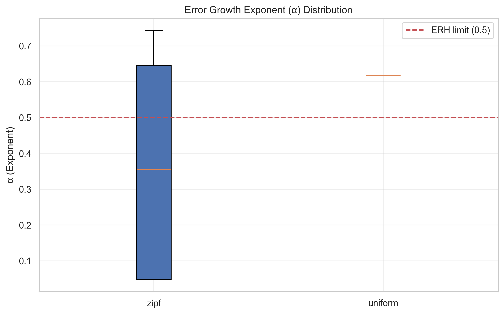
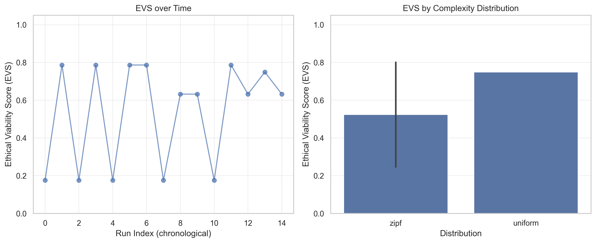

# ERH Simulation Campaign Report
**Generated:** 2026-02-09 10:08:56

## Overview
- Total Experiments: 15
- Distributions Tested: zipf, uniform

## Aggregate Statistics
                 mistake_rate  estimated_exponent  erh_satisfied       evs
complexity_dist                                                           
uniform              0.266667            0.617333            0.0  0.748992
zipf                 0.139286            0.356200            0.0  0.523934

## ERH Compliance
| Distribution | % Satisfied ERH |
|--------------|------------------|
| uniform | 0.0% |
| zipf | 0.0% |

## Ethical Viability Score (EVS)
| Distribution | Mean EVS |
|--------------|----------|
| uniform | 0.749 |
| zipf | 0.524 |

## Visualizations

